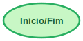
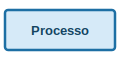
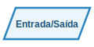
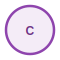
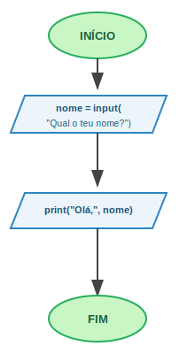
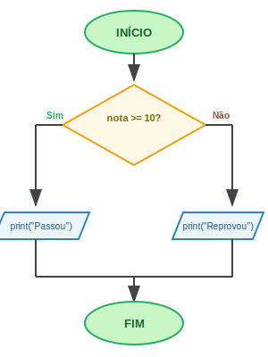
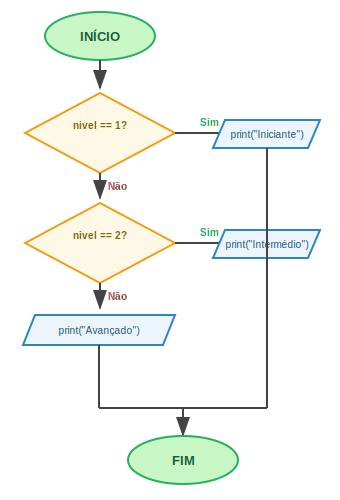
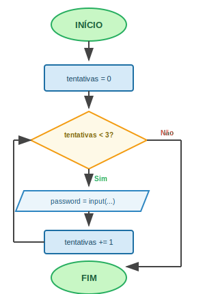
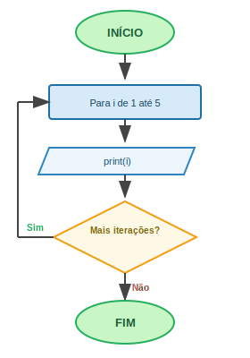
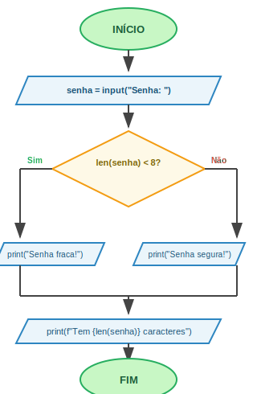

# 📊 Fluxogramas — Teoria e Draw.io

> **UC00606 · Linguagem Estruturada**  
> Como visualizar a lógica de um programa antes de escrever código.

---

## 🧠 O que é um Fluxograma?

Um **fluxograma** é um diagrama que representa a sequência de passos de um algoritmo ou processo.  
É como um mapa: mostra *o que acontece*, *em que ordem*, e *o que o programa decide*.

**Porquê usar fluxogramas?**

- ✅ Planear o programa *antes* de escrever código
- ✅ Detetar erros de lógica cedo (antes de executar)
- ✅ Comunicar a ideia a outras pessoas
- ✅ Documentar o que o código faz
- ✅ Traduzir pseudocódigo para código de forma mais segura

> 💡 Na UC00245 já desenhaste fluxogramas — aqui vais aprender a usá-los diretamente ligados ao Python.

---

## 🔷 Símbolos Standard (ISO 5807)

Todos os fluxogramas usam os mesmos símbolos. Aprende estes e consegues ler qualquer fluxograma.

| Símbolo | Nome | Quando usar |
|---------|------|-------------|
|  | **Início / Fim** | Sempre o primeiro e o último elemento |
|  | **Processo** | Operação, cálculo, atribuição de variável |
|  | **Decisão** | Condição `if` — tem SEMPRE saída Sim e Não |
|  | **Entrada / Saída** | `input()` e `print()` |
|  | **Conector** | Ligar partes distantes do diagrama |
|  | **Fluxo** | Direção do programa — sempre seguir as setas |

---

## 📐 Regras para um Bom Fluxograma

### Regras obrigatórias

1. **Um único ponto de início** — apenas um oval "Início"
2. **Um único ponto de fim** — apenas um oval "Fim" (ou poucos, se necessário)
3. **O losango tem SEMPRE duas saídas** — "Sim" (Verdadeiro) e "Não" (Falso)
4. **As setas não se cruzam** — se for inevitável, usa conectores
5. **Sentido geral: de cima para baixo, da esquerda para a direita**

### Boas práticas

- Escreve texto curto dentro dos símbolos
- Usa verbos nos retângulos: *"Calcular idade"*, *"Atribuir nota"*
- Usa perguntas nos losangos: *"Idade ≥ 18?"*, *"Nota > 9.5?"*
- Mantém o diagrama numa única página (se possível)
- Alinha os elementos na vertical/horizontal

---

## 🔄 Estruturas Fundamentais em Fluxograma

### 1. Sequência (sempre presente)



```python
# Código equivalente
nome = input("Qual o teu nome? ")
print("Olá,", nome)
```

---

### 2. Seleção — if / else



```python
# Código equivalente
nota = float(input("Nota: "))
if nota >= 10:
    print("Passou")
else:
    print("Reprovou")
```

---

### 3. Seleção Múltipla — if / elif / else



```python
# Código equivalente
nivel = int(input("Nível (1-3): "))
if nivel == 1:
    print("Iniciante")
elif nivel == 2:
    print("Intermédio")
else:
    print("Avançado")
```

---

### 4. Repetição — while (ciclo com condição)



```python
# Código equivalente
tentativas = 0
while tentativas < 3:
    password = input("Password: ")
    if password == "1234":
        print("Acesso permitido!")
        break
    tentativas += 1
print("Bloqueado") if tentativas == 3 else None
```

---

### 5. Repetição — for (ciclo contado)



```python
# Código equivalente
for i in range(1, 6):
    print(i)
```

---

## 🖥️ Draw.io — Como Desenhar Fluxogramas

**Draw.io** (também chamado **diagrams.net**) é uma ferramenta gratuita, sem registo, para desenhar diagramas.

🔗 **Acesso:** [app.diagrams.net](https://app.diagrams.net) — funciona diretamente no browser.

---

### Passo 1 — Abrir o Draw.io

1. Vai a [app.diagrams.net](https://app.diagrams.net)
2. Escolhe onde guardar: **"Device"** (no teu computador) ou **Google Drive / OneDrive**
3. Clica **"Create New Diagram"**
4. Escolhe o template **"Flowchart"** (ou "Blank" para começar do zero)
5. Clica **"Create"**

---

### Passo 2 — Conhecer a Interface

```
┌────────────────────────────────────────────────────────────┐
│  FILE  EDIT  VIEW  EXTRAS  HELP          [Export] [Share]  │ ← Menu
├────────────┬───────────────────────────────────────────────┤
│            │                                               │
│  PAINÉIS   │              ÁREA DE TRABALHO                 │
│  ESQUERDA  │                                               │
│            │     ┌───────┐     ┌───────────┐              │
│ • Formas   │     │INÍCIO │────▶│ variável  │              │
│   (shapes) │     └───────┘     └───────────┘              │
│            │                                               │
│ • Pesquisa │                                               │
│   de forma │                                               │
│            │                                               │
├────────────┤                                               │
│  PAINEL    │                                               │
│  DIREITO   │                                               │
│            │                                               │
│ • Estilo   │                                               │
│ • Cor      │                                               │
│ • Tamanho  │                                               │
│ • Texto    │                                               │
└────────────┴───────────────────────────────────────────────┘
```

---

### Passo 3 — Adicionar Formas

**Método 1 — Arrastar do painel:**
1. No painel esquerdo, procura a secção **"Flowchart"**
2. Arrasta a forma para a área de trabalho

**Método 2 — Duplo clique na área de trabalho:**
1. Faz duplo clique na área de trabalho
2. Escreve o texto — aparece um retângulo por omissão
3. Clica fora para confirmar

**Método 3 — Hover + clique azul (o mais rápido):**
1. Passa o rato sobre uma forma existente
2. Aparecem setas azuis nos 4 lados
3. Clica numa seta azul → cria automaticamente uma nova forma ligada

---

### Passo 4 — Mudar o Tipo de Forma

Para usar o símbolo certo (oval, losango, etc.):

1. Clica com o **botão direito** na forma
2. Seleciona **"Edit Style"** (ou `Ctrl+E`)
3. Substitui o estilo, ou:

**Alternativa mais fácil:**
1. Clica na forma
2. No painel direito, clica em **"Style"**
3. Clica no ícone da forma atual → abre galeria de formas
4. Escolhe a forma correta da secção **"Flowchart"**

**Estilos rápidos para copiar:**

| Símbolo | Estilo Draw.io |
|---------|---------------|
| Início / Fim | `ellipse;whiteSpace=wrap;html=1;` |
| Processo | `rounded=0;whiteSpace=wrap;html=1;` |
| Decisão | `rhombus;whiteSpace=wrap;html=1;` |
| Entrada / Saída | `parallelogram;perimeter=parallelogramPerimeter;whiteSpace=wrap;html=1;` |
| Conector | `ellipse;aspect=fixed;` |

---

### Passo 5 — Ligar Formas (Setas)

**Método 1 — Hover azul:**
1. Passa o rato sobre a forma de origem
2. Aparece uma seta azul no lado que queres
3. Clica e arrasta até à forma de destino
4. Solta — a ligação fica feita

**Método 2 — Ponto verde:**
1. Passa o rato sobre a forma → aparecem pontos verdes nos lados
2. Arrasta a partir de um ponto verde

**Método 3 — Arrastar sem forma:**
1. Passa o rato sobre uma forma até aparecer o contorno azul
2. Arrasta a partir do centro da forma → cria uma seta solta
3. Liga o final a outra forma

**Para adicionar texto às setas:**
- Faz duplo clique na seta → escreve "Sim" ou "Não"

---

### Passo 6 — Formatar (Cores e Estilo)

Seleciona uma ou mais formas e usa o painel direito:

| O que mudar | Onde encontrar |
|-------------|---------------|
| Cor de fundo | "Fill Color" → clica no quadrado de cor |
| Cor da borda | "Stroke Color" |
| Cor do texto | "Font Color" |
| Tamanho do texto | "Font Size" |
| Negrito / Itálico | Ícones na secção "Font" |
| Arredondar cantos | "Rounded" (checkbox) |

**Paleta de cores sugerida para fluxogramas:**

| Símbolo | Cor sugerida |
|---------|-------------|
| Início / Fim | Verde `#00C851` ou Azul escuro `#1A2744` |
| Processo | Branco `#FFFFFF` com borda cinza |
| Decisão | Amarelo `#FFD700` ou Laranja `#FF8C00` |
| Entrada / Saída | Azul claro `#2E86C1` |

---

### Passo 7 — Guardar e Exportar

**Guardar como .drawio (para editar depois):**
- `File → Save` ou `Ctrl+S`
- Guarda como ficheiro `.drawio` (XML) no teu computador

**Exportar como imagem:**
1. `File → Export As → PNG` (ou SVG, PDF)
2. Ajusta a escala (200% para melhor resolução)
3. Clica **Export**

**Exportar como PDF:**
1. `File → Export As → PDF`
2. Ideal para imprimir ou entregar ao professor

---

## ⌨️ Atalhos de Teclado do Draw.io

| Ação | Atalho |
|------|--------|
| Selecionar todos | `Ctrl+A` |
| Copiar | `Ctrl+C` |
| Colar | `Ctrl+V` |
| Duplicar | `Ctrl+D` |
| Desfazer | `Ctrl+Z` |
| Refazer | `Ctrl+Y` |
| Editar estilo | `Ctrl+E` |
| Ajustar à página | `Ctrl+Shift+H` |
| Zoom + | `Ctrl++` |
| Zoom - | `Ctrl+-` |
| Novo elemento | Duplo clique na área |
| Mover elemento | Setas do teclado (com elemento selecionado) |
| Alinhar elementos | Seleciona múltiplos → clique direito → "Align" |
| Distribuir uniformemente | Seleciona múltiplos → clique direito → "Distribute" |

---

## 🚀 Exercício Prático — Fluxograma + Python

Desenha em Draw.io o fluxograma do seguinte programa e depois escreve o código:

### Enunciado: Verificador de Senha

O programa deve:
1. Pedir uma senha ao utilizador
2. Se a senha tiver **menos de 8 caracteres** → mostrar "Senha fraca"
3. Se a senha tiver **8 ou mais caracteres** → mostrar "Senha segura"
4. Em ambos os casos → mostrar quantos caracteres tem a senha

**Fluxograma:**



**Código Python:**

```python
senha = input("Introduz a tua senha: ")

if len(senha) < 8:
    print("Senha fraca!")
else:
    print("Senha segura!")

print(f"A senha tem {len(senha)} caracteres.")
```

---

## 💡 Dicas para a Aula

- **Começa sempre pelo fluxograma** antes de escrever código — economiza tempo
- No Draw.io, usa `Ctrl+D` para duplicar formas do mesmo tipo (em vez de arrastar sempre do painel)
- Para fluxogramas de if/elif: desenha uma cadeia de losangos em cascata
- Para fluxogramas de while: desenha uma seta que volta para trás (para o losango)
- Guarda o ficheiro `.drawio` — podes reutilizá-lo e modificá-lo em aulas futuras
- Exporta como PNG para incluir no relatório ou entregar ao professor

---

## 🔗 Recursos Úteis

| Recurso | Link |
|---------|------|
| Draw.io online | [app.diagrams.net](https://app.diagrams.net) |
| Draw.io para VS Code | [Extensão diagrams.net](https://marketplace.visualstudio.com/items?itemName=hediet.vscode-drawio) |
| Draw.io para desktop | [github.com/jgraph/drawio-desktop](https://github.com/jgraph/drawio-desktop/releases) |
| Símbolos ISO 5807 | Padrão internacional de fluxogramas |
| Tutorial em vídeo | Pesquisa "draw.io tutorial flowchart" no YouTube |

---

## 📚 Leitura Extra — O que é um Fluxograma? (Miro)

> **Fonte recomendada:** [miro.com — O que é um Fluxograma?](https://miro.com/pt/fluxograma/o-que-e-fluxograma/)

O artigo da **Miro** aprofunda vários conceitos importantes que complementam o que aprendemos aqui:

**História e origem**
- Os fluxogramas foram criados por **Frank Gilbreth** em 1921 para a ASME (American Society of Mechanical Engineers)
- Desde os anos 1940 tornaram-se essenciais na programação e engenharia de processos

**Tipos de fluxogramas**
- **Fluxograma de processo** — sequência de passos num procedimento (o mais comum em programação)
- **Fluxograma swimlane** — divide responsabilidades entre diferentes atores (útil em equipas)
- **Fluxograma de dados** — mostra como os dados fluem entre sistemas
- **Fluxograma de decisão** — focado nos pontos de escolha (if/else em programação)

**Boas práticas segundo a Miro**
- Usa setas claras e consistentes (sempre na mesma direção: de cima para baixo ou da esquerda para a direita)
- Mantém o fluxograma numa única página sempre que possível
- Usa cores para distinguir tipos de operações (entradas, processos, decisões)
- Valida o fluxograma com outra pessoa antes de começar a programar

> 💡 **Dica:** A Miro também tem um editor de fluxogramas online gratuito em [miro.com](https://miro.com) — alternativa ao Draw.io, com colaboração em tempo real.

---

<sub>UC00606 · Linguagem Estruturada · ETPS · 2025/2026</sub>
